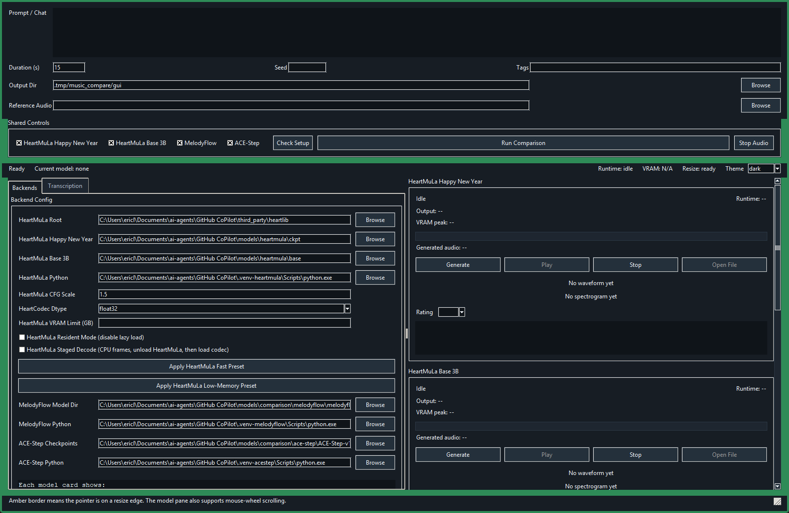
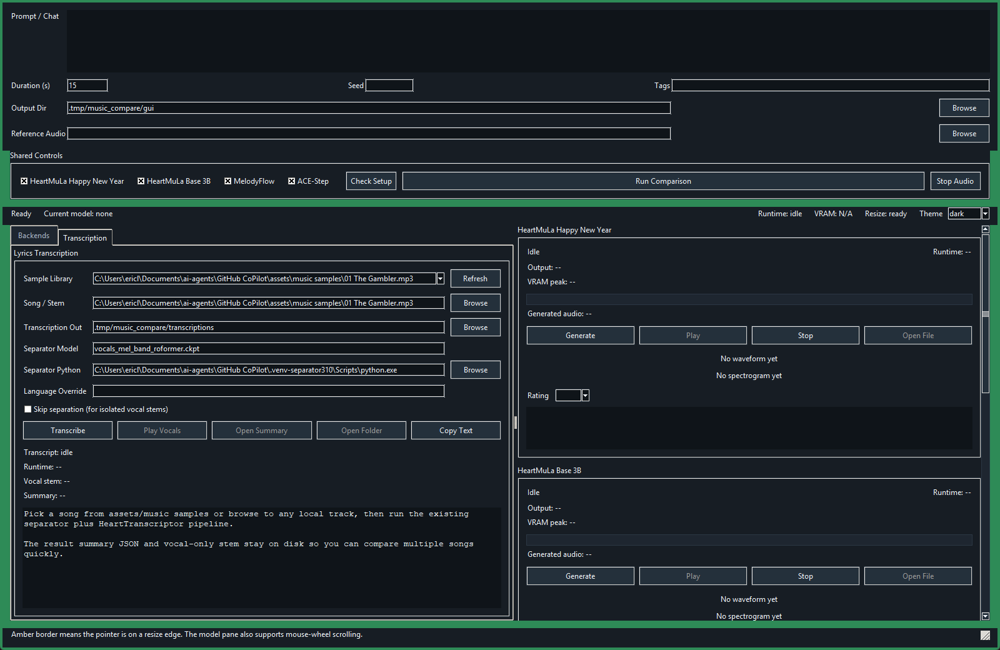

# AIMusicApp

AIMusicApp is a standalone local desktop workstation for comparing music-generation models, testing low-memory HeartMuLa configurations, and running lyrics transcription from the same UI.

This repository is the app layer. The underlying model libraries and checkpoints are expected to live under this repo in `third_party/` and `models/`, so the app can be cloned and operated independently of the old workspace layout.

## Latest Changes

- ACE-Step 1.5 Turbo and ACE-Step 1.5 SFT are now first-class comparison backends with separate model paths, model-specific defaults, and shared task support for `text2music`, `cover`, and `repaint`.
- The GUI now exposes ACE-Step 1.5 Turbo and SFT settings directly, including their recommended default configs, LM settings, inference steps, and guidance values, while still allowing manual overrides.
- The launcher and GUI now recover more reliably from stale backend Python settings by preferring a detected working ACE-Step 1.5 interpreter and seeding repo-local ACE-Step 1.5 defaults when present.
- Bootstrap and setup flows now support narrower model downloads, JSON-driven model selection, and the upstream `uv sync` environment path for ACE-Step 1.5.
- The desktop app now has unattended Tkinter integration coverage for comparison and transcription workflows, and the broader repo-local regression wrappers were expanded to include that coverage.
- Existing app quality-of-life improvements remain in place, including separate prompt, lyrics, and tags inputs, remembered text fields, a clear-text action, hover hints for backend input support, and improved left-pane scrolling.
- MelodyFlow local generation continues to use the published MelodyFlow Space code path instead of the older local Audiocraft reconstruction.
- HeartMuLa Happy New Year and HeartMuLa Base 3B remain supported in the comparison app alongside the newer ACE-Step paths.

## What This App Does

- Compare local music generators from one prompt.
- Run HeartMuLa in either fast or low-memory configurations.
- Benchmark outputs visually with waveform and spectrogram previews.
- Track runtime, generated-audio progress, and peak VRAM during a run.
- Rate outputs and save notes into the comparison summary.
- Run lyrics transcription with optional vocal separation.

## Supported Backends In The UI

- ACE-Step 1.5 Turbo
- ACE-Step 1.5 SFT
- HeartMuLa Happy New Year
- HeartMuLa Base 3B
- MelodyFlow
- ACE-Step v1-3.5B

## Repository Layout

- `tools/ai`: comparison GUI, backend launchers, setup helpers, and benchmarks
- `tools/audio`: vocal separation and ffmpeg helpers
- `tools/voice`: HeartTranscriptor orchestration
- `tools/common`: bootstrap helpers for a fresh clone
- `tests`: standalone regression tests for app behavior and backend wiring
- `docs/screenshots`: local README screenshots of the current UI
- `third_party`: local loader checkouts such as heartlib and ACE-Step
- `models`: local checkpoint and model download roots
- `.tmp`: local scratch space for generated summaries and helper checkouts such as MelodyFlow Space

## Clone And Initialize

```powershell
git clone https://github.com/ericleigh007/AIMusicApp.git
cd AIMusicApp
```

## Bootstrap From A Fresh Clone

Preferred bootstrap flow:

```powershell
bootstrap_AIMusicApp.bat
```

What that does by default:

- creates `.venv` if missing
- installs AIMusicApp into `.venv` with `pip install -e .`
- clones or updates the repo-local loader checkouts in `third_party/`

Optional full asset bootstrap:

```powershell
bootstrap_AIMusicApp.bat --download-models
```

Download only specific supported backends:

```powershell
bootstrap_AIMusicApp.bat --download-models --models ace_step_v15_turbo ace_step_v15_sft
```

Drive model selection from a JSON file:

```powershell
copy config\model_support.example.json .tmp\model_support.json
# Edit .tmp\model_support.json to enable only the backends you want locally.
bootstrap_AIMusicApp.bat --download-models --model-config .tmp\model_support.json
```

Optional AudioX asset bootstrap:

```powershell
bootstrap_AIMusicApp.bat --download-models --include-audiox
```

Dry-run preview:

```powershell
bootstrap_AIMusicApp.bat --dry-run
```

The bootstrap summary is written to `.tmp/bootstrap_summary.json` on non-dry runs.

The repo-local example selection file lives at `config/model_support.example.json`. The repository already ignores `models/`, so downloaded checkpoints remain local and are not staged for git.

## Launch The App

Preferred launcher:

```powershell
launch_AIMusicApp.bat
```

The launcher now does two useful things automatically:

- seeds the default ACE-Step 1.5 root, checkpoints, Turbo config, SFT config, and task settings when those paths exist under this repo
- chooses the first Python interpreter that can actually import the AIMusicApp UI dependencies, instead of blindly using a stale saved path

Direct Python launch from the repo root:

```powershell
python tools\ai\music_compare_gui.py
```

Installed console entry point after `pip install -e .`:

```powershell
aimusicapp-gui
```

## Recommended Local Setup

The app expects local model assets and Python environments to exist under this repo when you want the optional backends.

Typical local pieces:

- `.venv` or `.venv-1` for the app UI and shared helpers
- `.venv-heartmula` for HeartMuLa and heartlib
- `.venv-melodyflow` for MelodyFlow
- `.tmp/MelodyFlowSpace` for the official MelodyFlow Space repo used by the working local runner
- `.venv-acestep` for ACE-Step
- `third_party/ACE-Step-1.5/.venv` for ACE-Step 1.5
- `.venv-separator310` for transcription and vocal separation
- `models/heartmula/happy-new-year` for HeartMuLa HNY checkpoints
- `models/heartmula/base` for HeartMuLa Base checkpoints
- `models/comparison/...` for MelodyFlow, ACE-Step, and ACE-Step 1.5 model folders
- `config/model_support.example.json` as the example bootstrap selection file for choosing which backends to support locally

Repo-local backend env setup helpers:

- `setup_app_env.bat`
- `setup_heartmula_env.bat`
- `setup_melodyflow_env.bat`
- `setup_acestep_env.bat`
- `setup_acestep15_env.bat`

These scripts create the corresponding `.venv*` directory under the repo and install the best-known package surface for that backend. The loader-specific scripts expect the corresponding checkout under `third_party/`, so run `bootstrap_AIMusicApp.bat` first.

ACE-Step 1.5 note:

- `setup_acestep15_env.bat` now uses the upstream `uv sync` workflow inside `third_party/ACE-Step-1.5`
- the resulting interpreter lives at `third_party/ACE-Step-1.5/.venv/Scripts/python.exe`
- the GUI auto-detects that interpreter before falling back to `.venv-acestep15`
- the ACE-Step 1.5 setup path expects a compatible Python in the `>=3.11, <3.13` range, with `3.12` preferred for the upstream workflow
- if you need to override the base interpreter selection, set `ACESTEP15_BASE_PYTHON` or pass `--base-python` to `tools/common/setup_backend_env.py acestep15`
- if `uv` is not already on `PATH`, install it with the upstream helper in `third_party/ACE-Step-1.5` or point `UV_EXE` at a working `uv.exe`

Example ACE-Step 1.5 setup paths:

```powershell
setup_acestep15_env.bat
```

```powershell
python tools\common\setup_backend_env.py acestep15 --base-python C:\path\to\python312.exe --recreate
```

## Build And Environment Notes

AIMusicApp is a local Python workstation, not a compiled desktop build. There is no separate packaging or binary build step required for normal use.

For day-to-day operation, the practical setup requirements are:

- initialize the repo-local loader checkouts in `third_party/`
- create the Python environments used by the app and backend runners
- install backend-specific dependencies into those environments
- download local checkpoint folders into `models/`

Minimum operational checklist:

1. Clone the repo.
2. Run `bootstrap_AIMusicApp.bat`.
3. Run `setup_app_env.bat` if you want a dedicated repo-local app env.
4. Run the backend env setup script for each backend you actually plan to use.
5. Ensure `.venv-heartmula` can import `heartlib` if you want HeartMuLa.
6. Ensure each optional backend environment is installed only if you intend to use that backend.
6. Run `Check Setup` in the app before your first comparison run.

If you want a smaller local install, use either `--models ...` or `--model-config ...` when running `bootstrap_AIMusicApp.bat --download-models` so only the selected backend assets are downloaded.

## Packaging And Build

AIMusicApp now includes [pyproject.toml](pyproject.toml) so visitors can install it directly from a fresh clone.

Editable install:

```powershell
pip install -e .
```

Wheel and source distribution build:

```powershell
python -m pip install build
python -m build
```

Release smoke test from a fresh environment:

```powershell
$basePython = "C:\path\to\python.exe"

# Build the wheel in an isolated environment
& $basePython -m venv .tmp\smoke-build
& .\.tmp\smoke-build\Scripts\python.exe -m pip install --upgrade pip build
& .\.tmp\smoke-build\Scripts\python.exe -m build

# Install the wheel into a separate isolated environment
& $basePython -m venv .tmp\smoke-install
& .\.tmp\smoke-install\Scripts\python.exe -m pip install --upgrade pip
& .\.tmp\smoke-install\Scripts\python.exe -m pip install .\dist\aimusicapp-0.1.0-py3-none-any.whl

# Run these from outside the repo root so Python cannot import the local source tree
Set-Location $env:TEMP
& "c:\path\to\AIMusicApp\.tmp\smoke-install\Scripts\python.exe" -c "import tools.ai.music_compare_gui as m; print(m.__file__)"
& "c:\path\to\AIMusicApp\.tmp\smoke-install\Scripts\aimusicapp-check-backends.exe" --help
```

Expected smoke-test result:

- the import path prints from `site-packages`, not from the repo checkout
- `aimusicapp-check-backends --help` prints usage successfully
- the repo-local test suite still passes from the repo root

Desktop UI regression test:

```powershell
run_desktop_regression_AIMusicApp.bat -q
```

This wrapper selects a usable Python interpreter, disables unrelated pytest plugin autoload, and runs the desktop regression gate for [tests/test_music_compare_gui_desktop.py](tests/test_music_compare_gui_desktop.py) plus [tests/test_music_compare_gui_settings.py](tests/test_music_compare_gui_settings.py).

It expects an interpreter that can import `tkinter`, `pytest`, `numpy`, `soundfile`, `PIL`, `scipy`, and `imageio_ffmpeg`. `setup_app_env.bat` installs the needed app-side test surface for this wrapper.

The suite launches the real Tkinter interface, drives the actual widgets without a human operator, and validates desktop regression coverage for setup checks, comparison runs, single-model generation, transcription, ratings persistence, and core UI state changes using deterministic test doubles.

Full regression gate:

```powershell
run_regression_AIMusicApp.bat -q
```

This wrapper runs the setup, backend wiring, comparison integration, bootstrap planning, GUI settings, and unattended desktop UI suites together as a single regression command.

On Windows, this is the broadest repo-local regression command for the app layer after backend smoke checks.

## Main Window Overview

The window has three working areas:

1. Top controls for prompt, duration, seed, tags, output directory, and optional reference audio.
2. Left notebook tabs for `Backends` and `Transcription`.
3. Right-side model cards for generation, playback, visual comparison, and ratings.

The status bar reports current run state, live runtime, live GPU memory, resize-edge status, and includes the `Theme` selector.

The screenshots below show the app in dark mode. You can switch to light mode at runtime from the status bar, and the choice is persisted in the GUI settings.

## Backends Tab



Use this tab to configure generation backends before running comparisons.

### What You Configure Here

- `HeartMuLa Root`: the local heartlib checkout
- `HeartMuLa Happy New Year`: checkpoint root for the HNY slot
- `HeartMuLa Base 3B`: checkpoint root for the base slot
- `HeartMuLa Python`: Python interpreter for HeartMuLa runs
- `HeartMuLa CFG Scale`: classifier-free guidance value shared by both HeartMuLa slots
- `HeartCodec Dtype`: `float32` or `bfloat16`
- `HeartMuLa VRAM Limit (GB)`: per-process CUDA cap for controlled experiments
- `HeartMuLa Resident Mode`: keeps model components loaded instead of lazy-loading
- `HeartMuLa Staged Decode`: generates frames, moves them to CPU, unloads HeartMuLa, then decodes with HeartCodec
- `Apply HeartMuLa Fast Preset`: validated fast path
- `Apply HeartMuLa Low-Memory Preset`: validated low-memory path
- `MelodyFlow Model Dir` and Python path
- `ACE-Step v1-3.5B Checkpoints` and Python path
- `ACE-Step 1.5 Root`, `ACE-Step 1.5 Checkpoints`, and Python path
- `ACE-Step 1.5 Turbo Config` and `ACE-Step 1.5 SFT Config`
- shared `ACE-Step 1.5 Task`, `Cover Strength`, `Repaint Start`, and `Repaint End`

MelodyFlow note:

- the working local path uses the official `MelodyFlow` implementation from `.tmp/MelodyFlowSpace`
- you can override that checkout with `MELODYFLOW_SPACE_DIR`
- the current local runner now exposes `text2music`, `cover`, and `repaint` for the ACE-Step 1.5 Turbo and SFT backends
- `Task = auto` keeps normal text generation when `Reference Audio` is empty and switches ACE-Step 1.5 Turbo and SFT to cover mode when `Reference Audio` is set
- `extract`, `lego`, and `complete` remain base-only upstream tasks and are not exposed here because this app is intentionally comparing the non-base 1.5 models
- the backend applies a `torch.load(..., weights_only=False)` compatibility shim because the released checkpoints predate the PyTorch 2.6 default change

### How To Use The Backends Tab

1. Click `Check Setup` from the shared controls once your paths are filled in.
2. Set the HeartMuLa checkpoint roots for the HNY and Base slots.
3. Confirm the interpreter paths for each backend environment.
4. Choose the HeartMuLa operating mode:
	`Fast preset` for quickest runs.
	`Low-memory preset` for smaller VRAM budgets.
5. Leave `HeartCodec Dtype` on `bfloat16` when memory headroom matters.
6. Use `Resident Mode` only when you want speed and have enough VRAM.
7. Use `Staged Decode` when testing 12 GB class cards or other tight GPU budgets.
8. Configure either ACE-Step line only if you intend to use it.
9. For ACE-Step 1.5 Turbo and SFT comparisons, leave `ACE-Step 1.5 Task` on `auto` for ordinary text generation.
10. Set `Reference Audio` plus `ACE-Step 1.5 Task = repaint` only when you want repaint behavior instead of cover behavior.
11. Return to the top controls, enter your prompt, choose duration, and click `Run Comparison` or `Generate` on a single model card.

### Recommended HeartMuLa Modes

- Fastest validated setup: `CFG 1.5`, resident mode enabled, staged decode disabled
- Lowest validated memory setup: `CFG 1.0`, `codec_dtype=bfloat16`, lazy load enabled, staged decode enabled

## GPU-Poor Operation

If you are trying to run HeartMuLa on a smaller GPU, the documented low-memory path in AIMusicApp is:

1. Use the `Backends` tab.
2. Click `Apply HeartMuLa Low-Memory Preset`.
3. Confirm these settings remain in place:
	`CFG 1.0`
	`HeartCodec Dtype = bfloat16`
	`lazy_load = true`
	`staged decode = true`
4. Keep resident mode off.
5. Optionally set `HeartMuLa VRAM Limit (GB)` when testing whether a run survives inside a target budget.

Why this is the recommended path:

- staged decode prevents HeartMuLa and HeartCodec from living on the GPU at the same time
- `bfloat16` reduces codec-stage memory without requiring a separate derived model artifact
- lazy loading allows each component to unload after its stage completes

This is the current supported guidance for low-memory operation in AIMusicApp. A separate quantized codec artifact is not part of the recommended workflow at this time.

## Transcription Tab



Use this tab to run the vocal-separation plus HeartTranscriptor pipeline against a song or vocal stem.

### What You Configure Here

- `Sample Library`: quick picker for locally available sample audio files
- `Song / Stem`: the source audio file to transcribe
- `Transcription Out`: output directory for JSON summaries and stems
- `Separator Model`: separation model checkpoint name
- `Separator Python`: Python interpreter for the separator environment
- `Language Override`: optional manual language hint
- `Skip separation`: use this when the input is already an isolated vocal stem

### How To Use The Transcription Tab

1. Choose a file from `Sample Library` or browse with `Song / Stem`.
2. Set `Transcription Out` to the directory where you want result files written.
3. Leave `Separator Model` at the default unless you are benchmarking another separator.
4. Leave `Skip separation` off for full songs.
5. Turn `Skip separation` on only for isolated vocals or already-separated stems.
6. Enter a `Language Override` only when auto-detection struggles.
7. Click `Transcribe`.
8. After completion, use `Play Vocals`, `Open Summary`, `Open Folder`, or `Copy Text` depending on what you want next.

## Top Controls And Run Flow

The top area drives all generation runs.

- `Prompt / Chat`: main text prompt for music generation
- `Duration (s)`: requested audio length
- `Seed`: optional deterministic seed
- `Tags`: extra tag string for models that use tag conditioning
- `Output Dir`: destination for generated audio and summaries
- `Reference Audio`: used by ACE-Step 1.5 Turbo and ACE-Step 1.5 SFT for `cover` and `repaint` tasks, and reserved for other backends that may later use source-audio conditioning

### Typical Generation Workflow

1. Choose which models are enabled in `Shared Controls`.
2. Click `Check Setup` if anything about the environment changed.
3. Enter the prompt, duration, optional seed, tags, and output directory.
4. Open `Backends` and choose fast or low-memory behavior.
5. Click `Run Comparison` to run all enabled models, or `Generate` on a single model card.
6. Watch the status bar and card progress while each backend runs.
7. Use the card controls to play outputs, open files, and record ratings.

## Right-Side Model Cards

Each model card represents one backend and persists its own results in the current comparison session.

Every card shows:

- Backend status
- Runtime
- Output file path
- Peak VRAM observed during that run
- Generated audio progress
- `Generate`, `Play`, `Stop`, and `Open File` controls
- Waveform preview
- Spectrogram preview
- Rating selector
- Notes box

Ratings and notes are persisted into the comparison summary output so you can review experiments later.

## Output Locations

- Default comparison output: `.tmp/music_compare/gui`
- Default transcription output: `.tmp/music_compare/transcriptions`

These defaults are local working directories and are intentionally not committed.

## Low-Memory Decision

At this point, AIMusicApp treats `HeartCodec Dtype = bfloat16` as the preferred low-memory codec option instead of maintaining a separate quantized HeartCodec release.

Why this is the current direction:

- `bfloat16` already reduces codec-stage memory in the tested staged-decode workflow.
- It avoids maintaining a second codec artifact, conversion pipeline, and support matrix.
- It keeps the low-memory path simple enough to document and recommend.
- It gives us a cleaner story for upstream discussion: supported inference settings are easier to justify than publishing a separate derived model.

For now, the recommended low-memory HeartMuLa setup in this app is:

- `CFG 1.0`
- `HeartCodec Dtype = bfloat16`
- `lazy_load = true`
- `staged decode = true`

## Testing

Run the standalone regression suite from the AIMusicApp repo root:

```powershell
python -m unittest tests.test_music_compare_gui_settings tests.test_compare_music_models_integration tests.test_music_model_backends tests.test_music_backend_checks
```

## Troubleshooting

### Setup check fails

- Verify the Python executable path for the affected backend.
- Verify the model directory or checkpoint root exists.
- Re-run the local setup scripts if checkpoints are missing.

### MelodyFlow outputs buzz, hum, or non-musical garbage

- Verify the backend is using the official MelodyFlow Space checkout at `.tmp/MelodyFlowSpace` instead of the older local Audiocraft clone.
- Verify `.venv-melodyflow` can import the cloned Space repo and load `MelodyFlow.get_pretrained(...)`.
- Verify the model directory contains `state_dict.bin` and `compression_state_dict.bin`.
- If you are on PyTorch 2.6 or newer, make sure checkpoint loading uses `weights_only=False`.
- Use the current runner in `tools/ai/run_melodyflow_backend.py` rather than older local experiments.

### HeartMuLa runs out of memory

- Use `Apply HeartMuLa Low-Memory Preset`.
- Keep `HeartCodec Dtype` on `bfloat16`.
- Enable `HeartMuLa Staged Decode`.
- Avoid resident mode on smaller GPUs.
- Use `HeartMuLa VRAM Limit (GB)` only as a test aid, not as a guarantee.

### No sample files appear in the Transcription tab

- The sample library only shows local files under `assets/music samples` when that directory exists locally.
- Copyrighted audio is intentionally not tracked in git.

## Local Assets

Model weights, checkpoints, virtual environments, generated outputs, and copyrighted sample audio are intentionally not tracked in git.

## Naming

The app is now called AIMusicApp because the UI compares multiple model families and is no longer centered on HeartMuLa alone.
